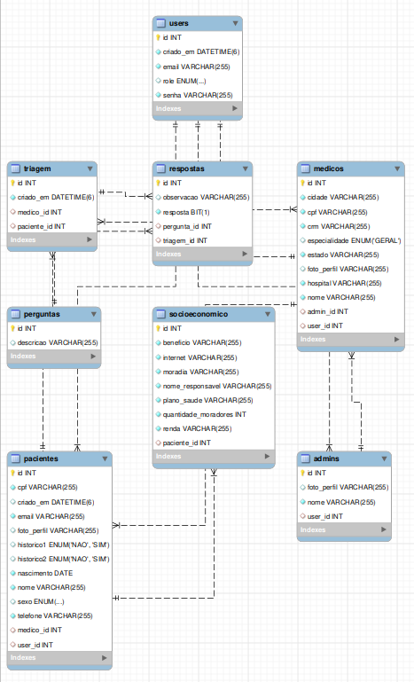
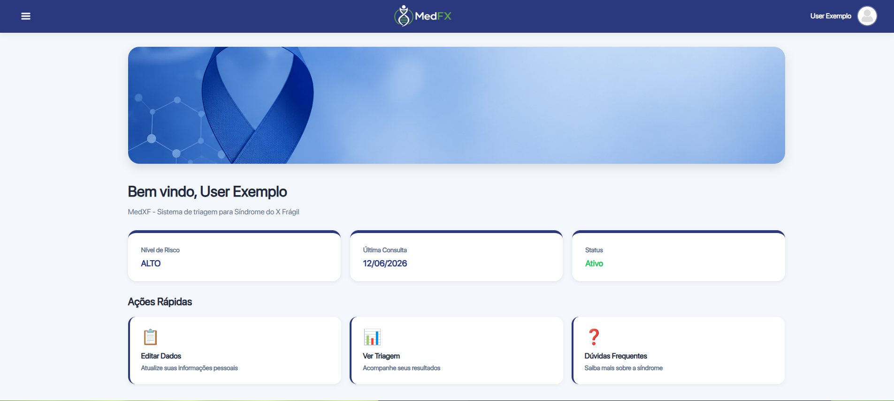
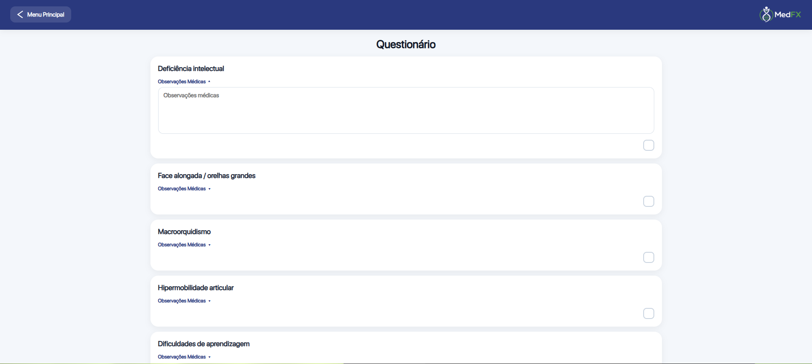

# MedXF - Sistema de Triagem para Síndrome do X Frágil


---

# 📌 O que é o MedXF?

O MedXF é um sistema web desenvolvido para auxiliar no processo de triagem da Síndrome do X Frágil, oferecendo uma plataforma para registro e acompanhamento inicial de informações dos pacientes.

O sistema permite o gerenciamento de médicos, pacientes, avaliações clínicas e triagens socioeconômicas, fornecendo uma ferramenta completa para acompanhamento dos casos.

Desenvolvido como atividade de extensão acadêmica da PUCPR, o projeto aplica conceitos de desenvolvimento Full Stack utilizando Java e Spring Boot em um contexto real voltado à área da saúde.

---

# ⚙️ Tecnologias e Ferramentas

| Categoria          | Tecnologias                                                    |
| ------------------ | -------------------------------------------------------------- |
| Backend            | Java, Spring Boot, Spring Security, Spring Data JPA, Hibernate |
| Frontend           | Thymeleaf, HTML, CSS, JavaScript                               |
| Banco de Dados     | MySQL                                                          |
| Build              | Maven                                                          |
| Controle de Versão | Git e GitHub                                                   |

---

# 🧩 Funcionalidades

## 👨‍💼 Administrador

* Login seguro
* Cadastro de médicos
* Gerenciamento de médicos
* Gerenciamento de pacientes
* Dashboard com indicadores
* Atualização de perfil

## 👨‍⚕️ Médico

* Login seguro
* Cadastro de pacientes
* Upload de foto do paciente
* Triagem socioeconômica
* Avaliação médica
* Consulta de pacientes cadastrados
* Relatórios de pacientes
* Atualização de perfil

## 👤 Paciente

* Login seguro
* Visualização dos dados pessoais
* Consulta da triagem realizada
* Consulta de avaliações
* Atualização de perfil

## 🔒 Segurança

* Autenticação com Spring Security
* Controle de acesso por perfis (ADMIN, USER e PACIENTE)
* Proteção de rotas por Role

---

# 🧠 Arquitetura do Projeto

```text
src/main/java
└── com/pucpr/medxf
    ├── controller
    ├── domain
    │   ├── admin
    │   ├── medico
    │   ├── paciente
    │   ├── pergunta
    │   ├── respostas
    │   ├── socioeconomico
    │   ├── triagem
    │   └── user
    │
    ├── infra
    │   ├── configurations
    │   └── security
    │
    └── MedxfApplication.java
```

---

# 🗄️ Modelo de Dados



---

# 🚀 Como executar o projeto

## 📌 Pré-requisitos

Antes de iniciar, você precisa ter instalado:

* Java 17+
* Maven 3.6+
* MySQL 8+
* Git

---

## 📥 Clonar o repositório

```bash
git clone https://github.com/seu-usuario/medxf.git
cd medxf/MedXF/backend
```

---

## 🗄️ Configurar o banco de dados

Crie o banco:

```sql
CREATE DATABASE medxf;
```

Configure as credenciais em:

```text
src/main/resources/application.properties
```

Exemplo:

```properties
spring.datasource.url=jdbc:mysql://localhost:3306/medxf
spring.datasource.username=root
spring.datasource.password=sua_senha

spring.jpa.hibernate.ddl-auto=update
spring.jpa.show-sql=true
```

---

## ▶️ Executar o projeto

Utilizando Maven:

```bash
mvn spring-boot:run
```

---

## 🌱 Popular o banco de dados

Após iniciar a aplicação, execute os comandos SQL abaixo:

```sql
-- senha de todos os usuários: 8676

insert into users (id, criado_em, email, role, senha)
values
(1, '2026-05-26 00:00:00.000000', 'admin@gmail.com', 'ADMIN',
'$2a$10$qT9ZZD9mpB9hOAYTblyf7eazwsTb0MWgWxbMuN34Umo7S89MyjPre');

insert into users (id, criado_em, email, role, senha)
values
(2, '2026-05-26 00:00:00.000000', 'medico@gmail.com', 'USER',
'$2a$10$qT9ZZD9mpB9hOAYTblyf7eazwsTb0MWgWxbMuN34Umo7S89MyjPre');

insert into admins (id, nome, user_id)
values
(1, 'AdminExemplo', 1);

insert into medicos
(id, cidade, cpf, crm, especialidade, estado, hospital, nome, user_id)
values
(1, 'Curitiba', '11812728905', '123456', 'GERAL', 'Paraná',
'Pequeno Príncipe', 'MedicoExemplo', 2);

insert into perguntas (descricao) values
('Deficiência intelectual'),
('Face alongada / orelhas grandes'),
('Macroorquidismo'),
('Hipermobilidade articular'),
('Dificuldades de aprendizagem'),
('Déficit de atenção'),
('Movimentos repetitivos'),
('Atraso na fala'),
('Hiperatividade'),
('Evita contato visual'),
('Evita contato físico'),
('Agressividade');
```

---

## 🔑 Usuários de teste

| Perfil        | E-mail                                      | Senha |
| ------------- | ------------------------------------------- | ----- |
| Administrador | [admin@gmail.com](mailto:admin@gmail.com)   | 8676  |
| Médico        | [medico@gmail.com](mailto:medico@gmail.com) | 8676  |

---

## 🌐 Acessar o sistema

Após iniciar a aplicação:

```text
http://localhost:8080/inicio
```

---

# 🔄 Fluxo da Aplicação

1. Administrador cadastra médicos
2. Médico realiza login
3. Médico cadastra paciente
4. Médico realiza triagem socioeconômica
5. Médico realiza avaliação clínica
6. Paciente consulta seus resultados

---

# 📸 Principais Telas

Adicione aqui screenshots do sistema:

Página inicial do paciente


Página inicial do médico


Página de triagem do médico


---

# 👨‍💻 Autores

Desenvolvido por:

* Nathan Okazaki
* Hugo Souza
* Ana Bruginski

Projeto de extensão acadêmica da PUCPR.
